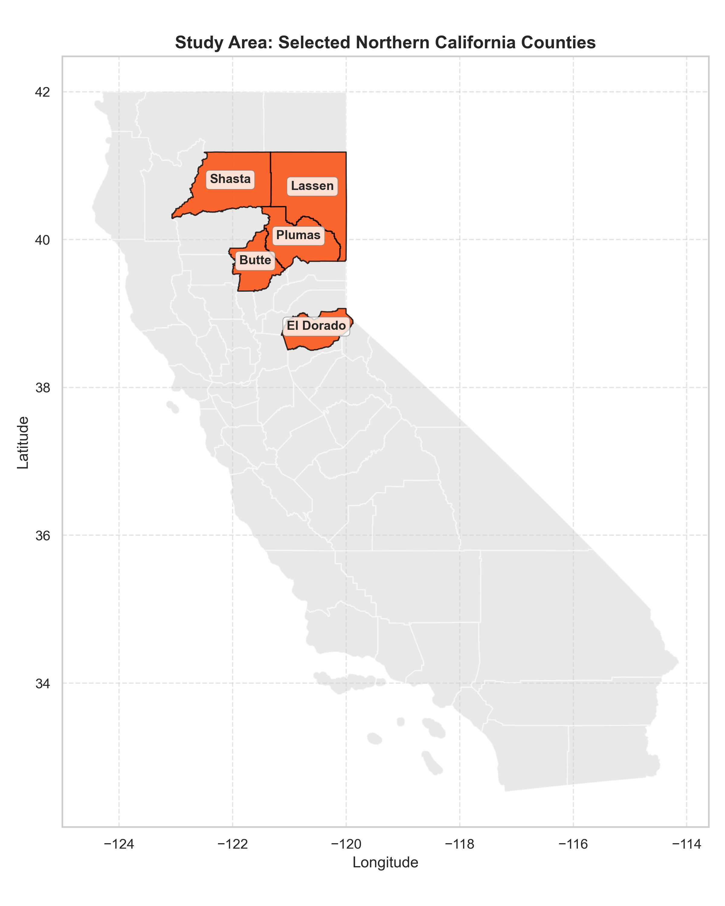
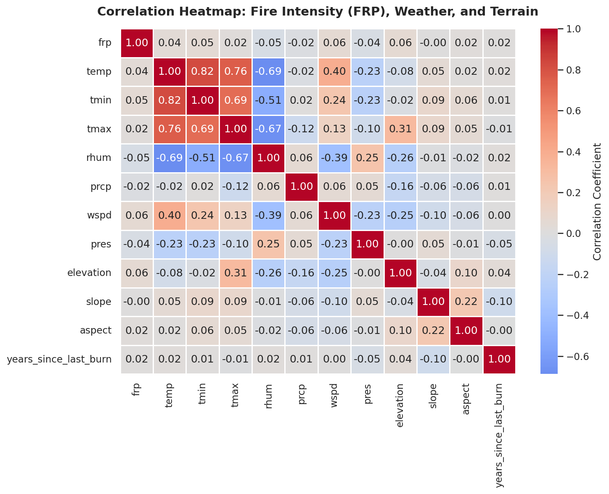
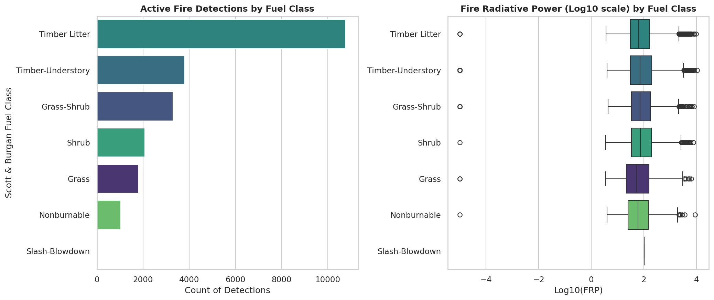

# Predicting Wildfire Radiative Power (FRP) in Northern California

An end-to-end machine learning pipeline to forecast wildfire radiative power (FRP) in Northern California using multi-source spatial data (active fires, meteorological time-series, digital elevation models, fuel classifications, and CAL FIRE burn history).

## Table of Contents
1. [Business Case & Objectives](#1-business-case--objectives)
2. [Study Area](#2-study-area)
3. [Data Sources & Ingestion Pipeline](#3-data-sources--ingestion-pipeline)
4. [Exploratory Data Analysis & Visualizations](#4-exploratory-data-analysis--visualizations)
5. [Baseline Modeling & Chronological Evaluation](#5-baseline-modeling--chronological-evaluation)
6. [Repository Structure & Reproducibility](#6-repository-structure--reproducibility)

---

## 1. Business Case & Objectives

Wildfires in California have increased in frequency and severity over the last decade, causing devastating ecological and economic damage. Forecasting fire intensity is critical for:
* **Emergency Resource Allocation:** Supplying fire suppression crews and aircraft to areas projected to experience extreme fire behavior.
* **Biomass and Emissions Modeling:** Estimating carbon emissions, particulate matter dispersion, and air quality impacts based on projected Fire Radiative Power (FRP).
* **Forestry & Fuel Management:** Identifying which fuel classes and topographic structures are most susceptible to high-intensity fires.

This project constructs a clean, unified feature matrix at a high spatial resolution (point-level coordinate mapping) to model and predict FRP across Northern California using advanced regression techniques.

---

## 2. Study Area

The study area focuses on five key fire-prone counties in Northern California: **Butte, Plumas, Shasta, El Dorado, and Lassen**. These counties represent a diverse transect of California's topography and vegetation, spanning the Sacramento Valley, the Sierra Nevada, and the Cascade range.

---

## 3. Data Sources & Ingestion Pipeline

To build our features, we programmatically query and merge five distinct spatial and temporal datasets:

1. **Active Fire Observations (NASA LANCE/FIRMS):**
   * **Source:** MODIS (MCD14DL) and VIIRS (VNP14IMGTDL) satellites.
   * **Ingestion:** Programmatically filtered for observations within California between 2020 and 2024, spatially intersecting the polygons of our 5 target counties. We only keep high-confidence detections.
   * **Target Variable:** Fire Radiative Power (FRP), measured in megawatts (MW), indicating fire heat release.

2. **Meteorological Observations (Meteostat API):**
   * **Source:** National Oceanic and Atmospheric Administration (NOAA) weather stations.
   * **Ingestion:** We dynamically query the locations of all active weather stations within the study area's bounding box (23 stations). Daily time-series weather parameters are downloaded and interpolated.
   * **Merging:** Using a spatial KD-Tree, each active fire coordinate is mapped to its closest weather station on the day of detection. Features include temperature, min/max temperature, relative humidity, precipitation, wind speed, and sea-level pressure. We handle gaps using time-series linear interpolation and median fallback imputation.

3. **Topography (USGS 3DEP Digital Elevation Model):**
   * **Source:** United States Geological Survey (USGS) 3D Elevation Program.
   * **Ingestion:** Programmatically queried via ArcGIS REST Image Services.
   * **Features:** Elevation (meters), slope (degrees), and aspect (flat terrain represented as -1, and aspect angles from 0 to 359 degrees). Out-of-bounds inputs are validated and cleaned.

4. **Vegetation Classification (LANDFIRE Database):**
   * **Source:** Scott & Burgan 40 Fire Behavior Fuel Models (FBFM40).
   * **Ingestion:** Queried in bulk chunks via the LANDFIRE ArcGIS REST Image Service.
   * **Features:** We map numeric FBFM40 fuel IDs to standard categorical vegetative fuel classes: *Grass, Grass-Shrub, Shrub, Timber-Understory, Timber Litter, Nonburnable, and Slash-Blowdown*.

5. **Historical Burn Perimeters (CAL FIRE FRAP):**
   * **Source:** California Department of Forestry and Fire Protection Fire and Resource Assessment Program.
   * **Ingestion:** Retrieved programmatically in paginated spatial queries using regional bounding envelopes.
   * **Features:** Spatially intersected using GeoPandas. For each active fire point, we locate all overlapping historical fire perimeters, identify the most recent previous fire strictly before the current detection year, and calculate the elapsed **Years Since Last Burn** (fuel age). Points with no historical perimeters on record default to 50 years.

---

## 4. Exploratory Data Analysis & Visualizations

We run Exploratory Data Analysis (EDA) on the final cleaned feature matrix:
* **Correlation Heatmap:** Visualizes correlations among weather conditions, topographic slope/elevation, fuel age, and the target FRP. As expected, daily temperatures and elevation show notable patterns, while wind speeds and humidity play key roles.

* **Fuel and FRP Distributions:** Shows the counts of fire detections and distributions of log-transformed FRP across the Scott & Burgan fuel classes. Timber Litter represents the most frequent fuel type, and Timber-Understory and Shrub exhibit distinct heat release profiles.

---

## 5. Baseline Modeling & Chronological Evaluation

To simulate a realistic forecasting scenario, we apply a **chronological out-of-time train-test split** to prevent temporal leakage:
* **Training Set:** Fires detected between **2020 and 2022** ($N = 21,454$ rows)
* **Test Set:** Fires detected between **2023 and 2024** ($N = 1,323$ rows)

### Data Leakage Prevention
During feature assembly, any target-derived helper columns (such as the log-transformed target `log_frp`) are explicitly removed from the feature set to ensure no look-ahead bias is introduced.

### Evaluation Metrics
We train a **Random Forest Regressor** and a **Gradient Boosting Regressor** and evaluate performance across two target scenarios (due to the highly skewed distribution of FRP):

#### Scenario 1: Training on Raw FRP
| Model | MAE | RMSE | $R^2$ |
| :--- | :--- | :--- | :--- |
| **Random Forest** | 237.77 | 386.88 | -0.627 |
| **Gradient Boosting** | 214.36 | 391.29 | -0.664 |

*Note: The negative $R^2$ scores indicate that modeling the highly skewed raw target values under an out-of-time chronological split is extremely volatile, heavily influenced by extreme outliers in the test set.*

#### Scenario 2: Training on Log-Transformed Target ($\log_{10}(\text{FRP} + 10^{-5})$)
| Model | Log MAE | Log RMSE | Log $R^2$ | Back-Transformed MAE | Back-Transformed $R^2$ |
| :--- | :--- | :--- | :--- | :--- | :--- |
| **Random Forest** | 0.399 | 0.554 | 0.047 | 102.10 | -0.020 |
| **Gradient Boosting** | 0.418 | 0.561 | 0.026 | 105.09 | -0.049 |

*By applying the log transformation, the target variance is stabilized, yielding a positive log-scale $R^2$ and reducing the back-transformed Mean Absolute Error (MAE) by more than 50% (from ~214 down to ~102).*

---

## 6. Repository Structure & Reproducibility

### Structure
* [`exploratory-data-analysis.ipynb`](exploratory-data-analysis.ipynb): The main Jupyter Notebook executing all phases of the project.
* `data/`: Directory containing all raw, processed, and clean datasets.
  * `fire_features_clean.csv`: Clean, imputed tabular feature matrix ready for machine learning.
* `img/`: Directory containing generated maps and EDA visualizations.
